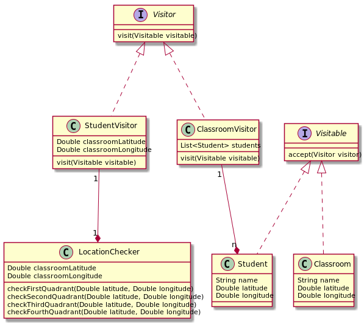

## Student Locator 
#### How to use

* Have a json file with the following stucture:
`{
    classrooms: [
        {name:"classroom name", latitude: y, longitude: x}
    ],
    students: [
        {name:"classroom name", latitude: y, longitude: x}
    ]
 }`
 
 * run `java -jar student-locator-0.0.1-SNAPSHOT.jar dataLocation={dataLocation}`
 * to run the tests run `mvn test`
 
 #### Design
 
 * Visitor pattern has been used. Classroom and Student classes accept visitors that will perform specific business logic. 
 * Class diagram is below:
 
 
 
 * ClassroomVisitor visits a Classroom and then will have StudentVisitor to visit each of the students to check Students location against Classroom location.
 * StudentVisitor uses the LocationChecker in order to check the location in each of the Classroom quadrants.
 * If Student is found then is added to the FoundStudentsStore singleton. 
 * Once the classrooms have been visited then found students lists is retrieved from FoundStudentsStore.  